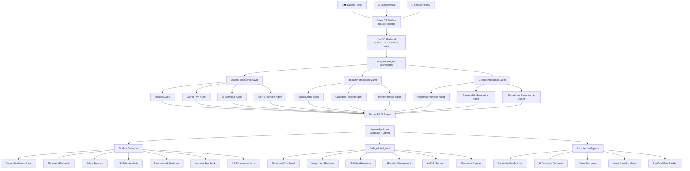

# CareerOS — Production-Ready Architecture

> **Role**: Staff Software Engineer  
> **Grade**: Startup-production (scale-ready, not over-engineered)  
> **Stack**: React+Vite (Existing) · FastAPI · Supabase PostgreSQL · Qdrant · Gemini 2.5 · n8n · ElevenLabs

---

## 1. Complete Folder Structure

*Note: This respects your existing `frontend/` folder. The backend and infrastructure are built alongside it, not over it.*

```
CareerOS_Innovik_6.0/
│
├── frontend/                            ← EXISTING: React + Vite + Tailwind v4 (Do Not Touch)
│   ├── src/
│   │   ├── pages/                       ← All 13 existing pages
│   │   ├── components/                  ← AppShell, Navbar, layout
│   │   ├── context/                     ← RoleContext, JobsContext (will connect to backend later)
│   │   ├── index.css                    ← Tailwind v4 theme variables
│   │   ├── App.tsx
│   │   └── main.tsx
│   ├── package.json
│   └── vite.config.ts
│
├── backend/                             ← NEW: FastAPI backend (modular monolith)
│   ├── app/
│   │   ├── main.py                      ← FastAPI app factory
│   │   ├── config.py                    ← Settings (pydantic-settings)
│   │   ├── dependencies.py              ← Shared DI (get_db, get_current_user, etc.)
│   │   ├── exceptions.py                ← Custom HTTP exceptions
│   │   │
│   │   ├── core/                        ← Cross-cutting concerns
│   │   │   ├── security.py              ← JWT, password hashing
│   │   │   ├── middleware.py            ← CORS, logging, rate limiting
│   │   │   ├── events.py                ← Startup/shutdown hooks
│   │   │   └── database.py              ← Supabase/asyncpg connection pool
│   │   │
│   │   ├── modules/                     ← Domain modules (router + service + repo + schemas)
│   │   │   ├── auth/
│   │   │   ├── students/
│   │   │   ├── career_twin/             ← Orchestrates Gemini + Qdrant calls
│   │   │   ├── resume/                  ← File parsing + Gemini analysis
│   │   │   ├── mentor/                  ← SSE streaming endpoint (ARIA)
│   │   │   ├── interview/               ← WebSocket endpoint (ECHO)
│   │   │   ├── jobs/                    ← NEXUS semantic search
│   │   │   ├── skills/
│   │   │   ├── recruiter/
│   │   │   ├── college/
│   │   │   ├── admin/
│   │   │   └── notifications/
│   │   │
│   │   └── services/                    ← External service integrations
│   │       ├── ai/
│   │       │   ├── gemini.py            ← Gemini 2.5 Flash/Pro client
│   │       │   ├── embeddings.py        ← Text embedding service
│   │       │   └── prompts/             ← System prompts per agent
│   │       ├── vector/
│   │       │   └── qdrant.py            ← Qdrant client wrapper
│   │       ├── voice/
│   │       │   └── elevenlabs.py        ← TTS/STT client
│   │       ├── storage/
│   │       │   └── supabase_storage.py
│   │       ├── email/
│   │       │   └── resend.py
│   │       └── n8n/
│   │           └── webhooks.py          ← Trigger n8n workflows
│   │
│   ├── migrations/                      ← Alembic migrations
│   ├── tests/
│   ├── requirements.txt
│   └── Dockerfile
│
├── infra/                               ← NEW: Infrastructure & Deployment
│   ├── docker/
│   │   ├── docker-compose.yml           ← Full local dev stack
│   │   ├── docker-compose.prod.yml      ← Production overrides
│   │   └── nginx/
│   │       └── nginx.conf
│   ├── k8s/                             ← Kubernetes manifests (future)
│   └── terraform/                       ← IaC (future)
│
├── docs/                                ← Documentation
│   ├── api-spec.yaml                    ← OpenAPI 3.1 spec
│   ├── frontend_analysis_report.md      ← (Generated previously)
│   └── architecture.md                  ← (This file)
│
└── .github/                             ← CI/CD Pipelines
    └── workflows/
        ├── ci-frontend.yml              
        ├── ci-backend.yml               
        └── deploy.yml                   
```

---

## 2. Backend Architecture

### Design Pattern: Modular Monolith

> **Why not microservices?** Startup-grade means moving fast without operational overhead. Each module is self-contained and can be extracted into its own service when traffic demands it.

```
┌─────────────────────────────────────────────────────────────┐
│                        FastAPI App                          │
│                                                             │
│  ┌──────────┐  ┌──────────┐  ┌──────────┐  ┌──────────┐   │
│  │   Auth   │  │ Students │  │  Career  │  │  Resume  │   │
│  │  Module  │  │  Module  │  │  Twin    │  │  Module  │   │
│  └────┬─────┘  └────┬─────┘  └────┬─────┘  └────┬─────┘   │
│       │              │             │              │         │
│  ┌──────────┐  ┌──────────┐  ┌──────────┐  ┌──────────┐   │
│  │  Mentor  │  │Interview │  │   Jobs   │  │  Skills  │   │
│  │  Module  │  │  Module  │  │  Module  │  │  Module  │   │
│  └────┬─────┘  └────┬─────┘  └────┬─────┘  └────┬─────┘   │
│       │              │             │              │         │
│  ┌──────────┐  ┌──────────┐  ┌──────────┐  ┌──────────┐   │
│  │Recruiter │  │ College  │  │  Admin   │  │ Notifs   │   │
│  │  Module  │  │  Module  │  │  Module  │  │  Module  │   │
│  └────┬─────┘  └────┬─────┘  └────┬─────┘  └────┬─────┘   │
│       └──────────────┴─────────────┴──────────────┘        │
│                            │                                │
│              ┌─────────────┼─────────────┐                  │
│              ▼             ▼             ▼                  │
│        [Services Layer]  [Core]    [Dependencies]           │
└─────────────────────────────────────────────────────────────┘
```

### Module Internal Structure (per domain)

```
module/
├── router.py       ← FastAPI APIRouter — only HTTP boundary, no logic
├── service.py      ← Business logic, orchestration, AI calls
├── repository.py   ← DB queries only (Repository Pattern)
├── schemas.py      ← Pydantic request/response models
└── models.py       ← SQLAlchemy ORM models
```

### Request Lifecycle

```
HTTP Request
    ↓
Middleware Stack (CORS → Auth → Rate Limit → Logging)
    ↓
Router (validates request schema)
    ↓
Dependency Injection (get_current_user, get_db)
    ↓
Service Layer (business logic)
    ├── Repository (DB read/write via Supabase)
    ├── AI Service (Gemini 2.5)
    ├── Vector Service (Qdrant)
    └── External Services (ElevenLabs, n8n, Storage)
    ↓
Response (Pydantic serialization)
    ↓
HTTP Response
```

### Communication Protocols by Feature

| Feature | Protocol | Why |
|---|---|---|
| Standard REST | HTTP/JSON | Auth, jobs, profile, admin |
| ARIA Chat | Server-Sent Events (SSE) | Streaming AI text tokens |
| ECHO Interview | WebSocket | Real-time audio + transcript bidirectional |
| Career Twin | HTTP/JSON + Background task | Compute-heavy, async trigger |
| File Upload | Multipart HTTP | Resume PDF/DOCX |
| Notifications | WebSocket or SSE | Real-time bell updates |

---

## 3. Service & AI Architecture

### LangGraph Agent Orchestrator

The system uses **LangGraph** as the core AI orchestrator, routing requests from the FastAPI backend to specific intelligence layers. All agents are powered by **Gemini 2.5** and retrieve context from the **Supabase + Qdrant** Knowledge Layer.



### Vector Service — Qdrant Collections

| Collection | Vectors Stored | Used By |
|---|---|---|
| `job_postings` | Job title + description embedding | Talent Search Agent |
| `candidate_profiles` | Student skills + bio embedding | Recruiter Intelligence Layer |
| `skill_taxonomy` | All skills normalized | Career Twin Agent |
| `interview_questions` | Question embeddings | ECHO Interview Agent |
| `course_catalog` | Course description embedding | ARIA Mentor Agent |

### n8n Workflows (Data Pipelines)

While LangGraph orchestrates the conversational and generative AI agents, **n8n** is retained for background ETL, webhooks, and chronological data triggers:

| Workflow | Trigger | What It Does |
|---|---|---|
| `job_match_alert` | New job posted (webhook) | Notify matched students via Email (Resend) |
| `college_weekly_report` | Monday 9am cron | Generate and email placement digest to College Admin |
| `ats_sync` | Recruiter moves candidate | Sync status back to Student dashboard |

---

## 4. Repository Pattern

### Base Repository (Abstract)

```
BaseRepository
├── get_by_id(id) → Model | None
├── get_all(filters, pagination) → list[Model]
├── create(data) → Model
├── update(id, data) → Model
├── delete(id) → bool
└── exists(filters) → bool
```

### Concrete Repositories per Domain

```
AuthRepository(BaseRepository)
├── get_by_email(email) → User | None
├── create_session(user_id, token) → Session
└── revoke_session(token) → bool

StudentRepository(BaseRepository)
├── get_with_profile(user_id) → StudentFull
...
(All domain repositories follow this pattern interacting directly with Supabase via asyncpg)
```

### Dependency Injection Pattern

```
FastAPI Dependency Chain:

get_db()
    └── yields asyncpg connection from pool

get_current_user(token: str = Depends(oauth2_scheme), db = Depends(get_db))
    └── validates JWT → returns User

get_current_student(user = Depends(get_current_user))
    └── asserts role == "student" → returns Student
```

---

## 5. API Architecture

### Base URL Structure

```
Production:   https://api.careeros.in/v1
Staging:      https://api-staging.careeros.in/v1
Local:        http://localhost:8000/v1
```

### Route Namespace Map (Matching Frontend Analysis)

```
/v1/auth/          ← Login, Register, Refresh
/v1/students/      ← Profile, Stats, Activity
/v1/career-twin/   ← Sync/Async twin compute
/v1/resume/        ← PDF parsing, Feedback
/v1/mentor/        ← Chat session, SSE streaming
/v1/interview/     ← WebSocket real-time evaluation
/v1/jobs/          ← Qdrant semantic search matching
/v1/applications/  ← App tracking
/v1/skills/        ← Gap analysis
/v1/recruiter/     ← Pipeline, Candidate matching
/v1/college/       ← Placement analytics, Drives
/v1/admin/         ← System KPIs
```

### Response Envelope Standard

```json
{
  "success": true,
  "data": { ... },
  "meta": {
    "page": 1,
    "pageSize": 20,
    "total": 150,
    "requestId": "req_abc123"
  },
  "error": null
}
```

---

## 6. Environment Variables

### `frontend/.env.local` (React + Vite)

```env
VITE_API_URL=http://localhost:8000/v1
VITE_APP_NAME=CareerOS
VITE_SUPABASE_URL=https://xxxx.supabase.co
VITE_SUPABASE_ANON_KEY=eyJ...
```

### `backend/.env` (FastAPI)

```env
APP_NAME=CareerOS API
APP_ENV=development
PORT=8000
ALLOWED_ORIGINS=http://localhost:5173,https://careeros.in

JWT_SECRET_KEY=<64-char-random-secret>

SUPABASE_URL=https://xxxx.supabase.co
SUPABASE_SERVICE_KEY=eyJ...
DATABASE_URL=postgresql+asyncpg://postgres:<password>@db.xxxx.supabase.co:5432/postgres

QDRANT_HOST=localhost
QDRANT_PORT=6333
QDRANT_API_KEY=<qdrant-api-key>

GOOGLE_API_KEY=AIza...
ELEVENLABS_API_KEY=sk_...
N8N_BASE_URL=http://n8n:5678
N8N_API_KEY=<n8n-api-key>
```

---

## 7. Docker Structure

### `infra/docker/docker-compose.yml`

```yaml
version: "3.9"

services:
  # ── Frontend ────────────────────────────────────────────
  frontend:
    build:
      context: ../../frontend
      dockerfile: Dockerfile.dev
    ports:
      - "5173:5173"
    volumes:
      - ../../frontend:/app
      - /app/node_modules
    networks:
      - careeros_net

  # ── Backend ─────────────────────────────────────────────
  api:
    build:
      context: ../../backend
      dockerfile: Dockerfile.dev
    ports:
      - "8000:8000"
    volumes:
      - ../../backend:/app
    env_file:
      - ../../backend/.env
    depends_on:
      - db
      - qdrant
    networks:
      - careeros_net
    command: uvicorn app.main:app --host 0.0.0.0 --port 8000 --reload

  # ── Infrastructure ──────────────────────────────────────
  db:
    image: postgres:16-alpine
    ports:
      - "5432:5432"
    networks:
      - careeros_net

  qdrant:
    image: qdrant/qdrant:latest
    ports:
      - "6333:6333"
    networks:
      - careeros_net

  n8n:
    image: n8nio/n8n:latest
    ports:
      - "5678:5678"
    networks:
      - careeros_net

networks:
  careeros_net:
    driver: bridge
```

---

## 8. Deployment Architecture

### Infrastructure Overview

```
Internet
    │
┌───▼─────────────────────────────┐
│   Cloudflare (DNS + CDN + WAF)  │
└───┬─────────────────────────────┘
    │
    ▼ (API Traffic)
┌─────────────────────────────────┐
│ Google Cloud Run (FastAPI)      │ ← Auto-scaling Serverless Backend
│ - AI Agent Services             │
│ - External API Orchestration    │
└─────────┬──────────────┬────────┘
          │              │
          ▼              ▼
┌────────────────┐ ┌──────────────┐
│ Qdrant Cloud   │ │ Supabase     │
│ (Managed VecDB)│ │ (Managed DB) │
└────────────────┘ └──────────────┘

    ▼ (Static Traffic)
┌─────────────────────────────────┐
│ Vercel / Netlify                │ ← Edge CDN for React + Vite Frontend
└─────────────────────────────────┘
```

### CI/CD Pipeline

```
Developer pushes code
        ↓
┌─────────────────────────┐
│   GitHub Actions CI     │
│   1. Lint Frontend      │
│   2. PyTest Backend     │
└──────────┬──────────────┘
           │ (on main merge)
    ┌──────▼──────────────────┐
    │   GitHub Actions CD     │
    │   1. Deploy frontend to │
    │      Vercel             │
    │   2. Build & Deploy API │
    │      to Google Cloud Run│
    └─────────────────────────┘
```
