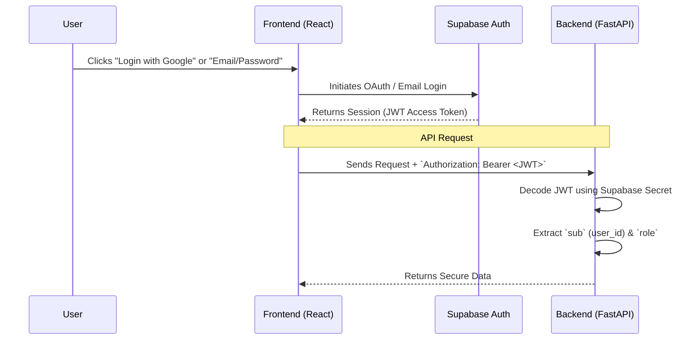

# Authentication Architecture (Supabase + FastAPI)

This document outlines the authentication and authorization flow for CareerOS, fulfilling the requirements of `prompt4.md`.

## 1. Authentication Flow

We utilize a decoupled architecture where **Supabase** acts as the Identity Provider (IdP) and **FastAPI** acts as the Resource Server.



### Role Synchronization (Supabase Webhook)
When a user signs up via Supabase Auth, they are inserted into `auth.users`. We use a PostgreSQL Trigger to automatically create a profile in our public `users` table:
```sql
CREATE OR REPLACE FUNCTION public.handle_new_user()
RETURNS trigger AS $$
BEGIN
  INSERT INTO public.users (id, email, role, full_name)
  VALUES (new.id, new.email, 'student', new.raw_user_meta_data->>'full_name');
  RETURN new;
END;
$$ LANGUAGE plpgsql SECURITY DEFINER;

CREATE TRIGGER on_auth_user_created
  AFTER INSERT ON auth.users
  FOR EACH ROW EXECUTE PROCEDURE public.handle_new_user();
```

---

## 2. Permissions Matrix (RBAC)

The system enforces 4 core roles. Roles are stored in the `users` table and embedded into the JWT as a custom claim (or queried dynamically based on the JWT `sub`).

| Role | Access Level | Permitted Operations |
| :--- | :--- | :--- |
| **Student** | Own Data Only | Create/Update own profile, upload resume, interact with Career Twin, view jobs, apply to jobs. |
| **College Admin** | College Data Only | View analytics for own college, view students affiliated with own college, monitor placement metrics. |
| **Recruiter** | Company Data Only | Create/Manage jobs for own company, view applicants, interact with Candidate Ranking Agent. |
| **Super Admin** | Unrestricted | Full system access, manage all tenants, view global analytics. |

---

## 3. Route Protection Strategy (FastAPI Middleware & Dependencies)

### The Security Dependency Pipeline
In FastAPI, we protect routes using dependency injection. We do not use standard "middleware" (which runs on *every* request, even public ones), but rather targeted route-level dependencies.

1. **`get_token`**: Extracts the Bearer token from the `Authorization` header.
2. **`verify_jwt_token`**: Uses `PyJWT` to verify the signature of the token using the `SUPABASE_JWT_SECRET`. It asserts the token is not expired and is issued by Supabase.
3. **`get_current_user`**: Extracts the `user_id` from the JWT `sub` claim. Checks the database to fetch the `users` record and role.

### Role-Based Dependencies
To protect specific routes, we compose dependencies:
- **`RequireRole("student")`**: Dependency that ensures `user.role == "student"`.

### Example Implementation Flow:
```python
@router.post("/resume/upload")
async def upload_resume(
    file: UploadFile, 
    user: User = Depends(RequireRole("student"))
):
    # Only authenticated users with the "student" role can reach this code
    pass
```

## 4. Kernel-Level Security (PostgreSQL RLS)

Even if an API route is incorrectly configured, **Row Level Security (RLS)** in PostgreSQL serves as a fail-safe.
When FastAPI connects to Supabase, it passes the authenticated user's ID to the Postgres session, ensuring that standard SQL queries physically cannot return rows belonging to other tenants.
